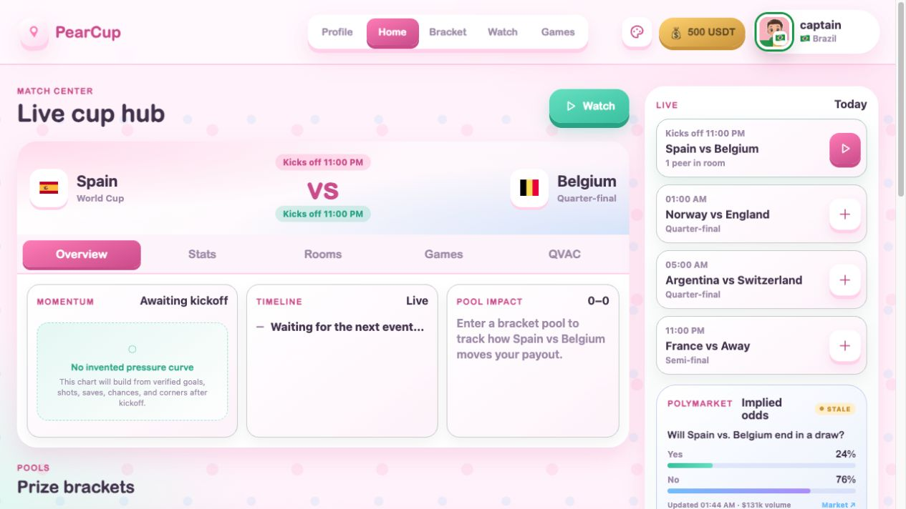

# PearCup 🍐⚽

**A World Cup bracket, watch party, and prediction game — built on the [Pear runtime](https://docs.pears.com/), with signed HiveRelay sync for browser-to-Pear multiplayer. No account required.**

Pick the knockout bracket, drop into a live watch room, and play real peer‑to‑peer penalty shootouts against friends. Pool entries are shared P2P using demo USDT; the production WDK payout rail remains locked until it is separately approved and configured.

## ▶ Official launch paths

```sh
pear run pear://ky9s3jx178s4cdsnkke4cpxmk9jx93eeb99q8aa5dnrjancirdeo
```

**Production links:**

- Pear Runtime: `pear://ky9s3jx178s4cdsnkke4cpxmk9jx93eeb99q8aa5dnrjancirdeo` (native release `10125`, seeded)
- PearBrowser / Hyperdrive: `hyper://0b3eb6272b00ab58f17844bd6cb3452145ffa7da6bd2283aa2590033ae83af0e/` (published and HiveRelay-pinned)

These are the two official launch surfaces for judging. Both ship the **live 2026 World Cup knockout bracket**, watch party, and P2P penalty minigame. The Cloudflare browser page is a support/preview surface, not the launch target.

### Pear Runtime

Install [Pear](https://docs.pears.com/) and run:

```sh
pear run pear://ky9s3jx178s4cdsnkke4cpxmk9jx93eeb99q8aa5dnrjancirdeo
```

### PearBrowser

Open the published Hyperdrive link in PearBrowser:

```text
hyper://0b3eb6272b00ab58f17844bd6cb3452145ffa7da6bd2283aa2590033ae83af0e/
```

If your PearBrowser build does not intercept `hyper://` links from Markdown, copy and paste the link into its address bar. The app icon and PearCup manifest are included in the published drive.

For diagnostics only, the browser support page is available at [pearcup-kawaii.pages.dev/play](https://pearcup-kawaii.pages.dev/play/); it is not the official launch path.

[▶ Watch the 2:20 demo](site/assets/demo.mp4) · [View the press kit](site/assets/press/) · [Open the marketing site](https://pearcup-kawaii.pages.dev)



## What's inside

- **🏆 Bracket + match pools** — rolling World Cup pools with totals derived only from actual peer submissions. Entries use **demo USDT** and cannot create a payout.
- **📺 Watch party** — a shared live match room with reactions, multilingual commentary, and a synced feed.
- **🎮 P2P penalty minigame** — real peer‑to‑peer penalty shootouts (Penalty Clash) over the swarm, with matchmaking, invites, and hidden‑guest handshakes.
- **💸 Safe money boundary** — the local demo wallet supports play testing; no pool entry sends wallet material, starts a WDK payment, or creates a cash payout. QVAC remains available for game evidence.
- **🌐 Cross-platform multiplayer** — PearBrowser and Pear Runtime share signed `pearcup-sync-v2` rooms through a dedicated HiveRelay OutboxLog endpoint; direct Holepunch remains an optional fast path/fallback.

The release gate currently covers **414 automated checks**, plus the Pear Runtime, PearBrowser/Hyper, live HiveRelay, and dual-client match smoke tests.

## Repository scope

This repository contains PearCup only. The separate multi-sport fork lives at
[bigdestiny2/ultimate-sports](https://github.com/bigdestiny2/ultimate-sports).

## Folder Map

- **[`app/`](app/)** — **PearCup**, the released Pear app (self‑contained: own `package.json`, `index.cjs`, P2P modules). **Start here.**
- `docs/` — current Pear runtime boundary and live-data operations notes.
- `scripts/` — release gates, staging, and publish helpers.
- `site/` — the marketing website; it is not an alternate app implementation.

See **[CONTRIBUTING.md](CONTRIBUTING.md)** for the module map and dev workflow, and **[`app/RELEASE.md`](app/RELEASE.md)** for the full stage → release → seed flow (including the space‑in‑path staging note).

## Run Locally

```sh
cd app
npm install          # restores git-ignored node_modules (required before pear stage)
pear run --dev .     # Pear desktop window with live local files
```

For a local PearBrowser-only preview, use `npm run serve:pearbrowser` from the repository root and open the checked Hyperdrive-shaped URL it prints. This is a development diagnostic, not the public launch path.

From the repo root, `npm run dev`, `npm run stage`, `npm run release`, and
`npm run seed` all route to this same canonical build. The root package is
private tooling and deliberately has no second Pear manifest.

## See multiplayer by yourself

1. Open PearCup and choose **Games → Invite a friend**.
2. Copy the generated `pear://…?join=<room>` invitation.
3. In a second terminal, run `pear run '<copied invitation>'`.
4. The second Pear window joins as the guest; accept the challenge and play the
   mirrored best-of-five Penalty Clash.

For a headless proof of the same host/guest handshake, run
`npm run smoke:kawaii-p2p-preview`.

## Test

```sh
npm test                 # unit + P2P + deep-link tests
npm run test:hiverelay-conformance # real local OutboxLog HTTP/SSE contract
npm run check            # runtime, boot bundle, and Pear-compat checks
npm run audit:launch     # QVAC / WDK / payout / compliance launch gates
```

## Architecture

The renderer stays SDK-free; a Pear **worker bridge** owns the WDK / QVAC
boundary. When configured, a generic HiveRelay OutboxLog endpoint provides
signed, short-lived room transport for browser-to-Pear play; direct Holepunch
is retained as an optional fast path. The current pool UI is intentionally
demo-only; its peer ledger is documented in
[`docs/demo-pool-ledger.md`](docs/demo-pool-ledger.md). Real-money rails remain
locked behind the existing SDK and compliance gates. See
[`docs/pear-runtime-boundary.md`](docs/pear-runtime-boundary.md) and
[`docs/hiverelay-pearcup-sync.md`](docs/hiverelay-pearcup-sync.md).
