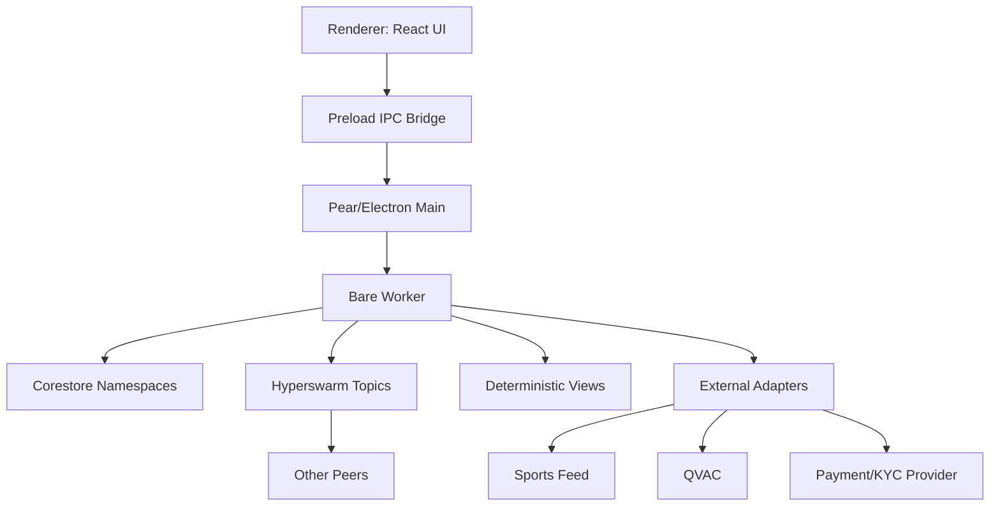

# PearCup Full Implementation Technical Specification

Version: 1.0
Date: 2026-07-01
Status: Build-ready product and engineering specification

## 1. Product Summary

PearCup is a Pear desktop app for World Cup knockout prediction pools and live social watch parties.

Users choose a country, create a username, receive a polished avatar wearing that country's jersey, enter prize-pool brackets at fixed entry tiers, submit knockout winners, and join live match rooms where avatars, chat, voice, shared video, live stats, and multilingual QVAC commentary create a shared match experience.

The app should feel like a premium sports product, not a betting spreadsheet. The core loop is:

1. Create identity: username, country, avatar.
2. Enter pool: choose $10, $25, $50, or $100 bracket.
3. Submit picks: round of 16, quarterfinals, semifinals, final.
4. Watch live: join match room, see who picked each team, chat, voice, stats, and commentary.
5. Resolve: bracket outcomes update, winners split the prize pool according to pool rules.

## 2. Design Principles

- Premium sports broadcast surface: dense, readable, confident, with no toy-like clutter.
- Avatar-first identity: avatars are a brand feature and must never look clipped, distorted, or random.
- Bracket precision: connector lines, round columns, cards, and pick ownership must align exactly.
- Live hub first: home screen shows current match status, schedule, pool deadlines, stats, and watch rooms.
- Pear-native where it matters: identity, rooms, chat, bracket submissions, and state sync should be peer-first.
- Centralized only where required: Tether WDK payment rails, KYC, legal compliance, official sports feeds, media rights checks, and trusted QVAC referee attestations.
- Real money is a compliance-gated mode. The app must support demo credits and sponsor-prize mode separately.

## 3. Target Platforms

- Primary: Pear desktop app.
- Development renderer: Vite plus TypeScript.
- UI runtime: React plus TypeScript, unless the hackathon constraints require vanilla DOM.
- Worker runtime: Bare worker inside Pear for P2P networking, Corestore persistence, and deterministic state reducers.
- Future: mobile companion app can reuse API contracts, data schemas, and design tokens.

## 4. Feature Scope

### 4.1 Hackathon MVP

- Country and username onboarding.
- High-quality AvatarKit replacement for current generated SVG.
- Home live hub with match overview, live menu, stats, rooms, pools, and leaderboard.
- Bracket-pool lobby for $10, $25, $50, $100 tiers using demo credits.
- Bracket builder for round of 16 through final.
- Bracket viewer showing team rows and usernames who picked each team.
- Watch party for one live fixture.
- Pick board above the TV showing who picked which team.
- Penalty Clash minigame with P2P session sync, deterministic results, and replayable rounds.
- Text chat replicated over Pear.
- Voice-state UI with mocked or local-device voice controls.
- Shared video slot with streamer controls and rights warning.
- Live statistics fixture feed.
- QVAC adapter interface with mocked multilingual commentary if the live QVAC SDK is unavailable.

### 4.2 Feature-Complete V1

- Real Pear peer discovery and room membership.
- Persistent profiles and signed bracket submissions.
- Multi-pool entry and settlement logic.
- Live official sports data provider integration.
- QVAC commentary pipeline with language selection and event summarization.
- P2P minigame matchmaking, spectator mode, room challenges, leaderboards, and signed game results.
- Voice chat and shared media transport.
- Moderation, reporting, blocking, and room host controls.
- Tether WDK payment/escrow integration, KYC, geofencing, age checks, tax records, and jurisdiction controls.
- Replayable audit log for pool entries, bracket locks, official results, and settlement.

### 4.3 Explicit Non-Goals For MVP

- No real-money launch without legal review.
- No copyrighted broadcast restreaming unless the streamer and platform have rights.
- No on-chain settlement unless separately scoped.
- No hand-built custom payment or KYC stack.

## 5. Information Architecture

### 5.1 Top Navigation

- Profile
- Home
- Bracket
- Watch
- Games

### 5.2 Required Screens

Profile:
- Username input.
- Country/team selector.
- Avatar preview.
- Jersey kit preview.
- Account and compliance status when real-money mode is enabled.

Home:
- Live match hero with score, clock, flags, possession, threat, room count.
- Live menu tabs: Overview, Stats, Rooms, QVAC, Pools.
- Prize-pool cards by tier.
- Fixture rail: live, upcoming, closed.
- Pool leaderboard.
- Pear room signal: peers, sync lag, QVAC lane, media state.

Pools:
- Tier list: $10, $25, $50, $100.
- Entrant count, prize pool, close time, max entries, status.
- Entry CTA.
- Demo-money/real-money mode indicator.
- Compliance gating if money is real.

Bracket Builder:
- Four rounds: round of 16, quarterfinals, semifinals, final.
- Match cards with flags, team names, status, scores, pick owners.
- Exact connector lines drawn from measured DOM geometry or SVG layout coordinates.
- Pick state and undo/reset.
- Submission state: draft, submitted, locked, resolved.

Bracket Viewer:
- Pool-level aggregate picks.
- Username chips beside selected teams.
- Current result state.
- Leaderboard impact.
- Tie and settlement preview.

Watch Party:
- Match title and score.
- Pick board above TV: one card per team, showing avatars/usernames for participants who picked that team.
- Shared TV surface for video stream or match visualization.
- Stats strip.
- Commentary panel with language controls.
- Room chat.
- Voice state and participant controls.
- No duplicate lower avatar strip under the TV.

Games:
- Penalty Clash lobby.
- Quick challenge from watch room.
- Private invite and rematch flow.
- Spectator view for active games.
- Player leaderboard.
- Sync health indicator: peer latency, turn status, reveal status, state hash.
- Replay viewer for completed rounds.

Settings:
- Profile, region, language, audio/video devices, privacy, moderation, legal notices.

## 6. Visual System

### 6.1 Design Tokens

Use a tokenized theme so the app can evolve without CSS drift.

```ts
type DesignTokens = {
  color: {
    ink: string
    muted: string
    panel: string
    surface: string
    field: string
    border: string
    success: string
    danger: string
    live: string
    pear: string
  }
  radius: {
    control: '8px'
    panel: '10px'
    avatar: '14px'
  }
  shadow: {
    panel: string
    raised: string
    avatar: string
  }
  space: Record<4 | 6 | 8 | 10 | 12 | 16 | 20 | 24 | 32, string>
}
```

### 6.2 UI Quality Rules

- Cards must not be nested inside decorative cards.
- Text must not overlap, wrap unpredictably, or clip at mobile widths.
- Controls use icons where appropriate: mic, screen, send, reset, submit, play.
- Dense product surfaces use compact headings, not hero-scale typography.
- Bracket and watch room must pass visual regression tests at desktop and mobile widths.
- Any fixed-format UI, including avatar chips and bracket cards, must have stable dimensions.

## 7. AvatarKit Specification

The current prototype uses inline SVG full-body avatars in small slots. That should be replaced. The production system needs separate avatar render modes with safe areas.

### 7.1 Avatar Render Modes

FullBody:
- Used on profile screen and large watch-room participant surfaces.
- Aspect ratio: 4:5.
- Minimum visual container: 160 x 200.
- Shows full jersey, shorts, shoes, pose, optional prop.

Bust:
- Used in watch-pick cards, profile chips, leaderboard rows, chat messages.
- Aspect ratio: 1:1.
- Minimum visual container: 44 x 44.
- Shows head, shoulders, jersey collar, badge color.
- No full legs, no jersey number text, no tiny labels inside art.

Token:
- Used in crowded lists and stacked groups.
- Aspect ratio: 1:1.
- Minimum visual container: 32 x 32.
- Face plus jersey color rim.
- Labels are outside the token, not inside the image.

Sticker:
- Used for celebratory results and share cards.
- Aspect ratio: 1:1 or 4:5.
- Higher detail and expressive pose.

### 7.2 Avatar Asset Pipeline

Recommended production approach:

1. Define a vector source rig in Figma, Rive, Spine, or Lottie.
2. Export layered parts: skin, hair, expression, body, jersey, accessories.
3. Render deterministic combinations using an AvatarKit service.
4. Cache final assets locally as WebP or PNG at multiple sizes.
5. Store avatar recipe in user profile, not only final pixels.

```ts
type AvatarRecipe = {
  version: 'avatar-kit-v1'
  seed: string
  skinTone: string
  hairStyle: string
  hairColor: string
  faceShape: string
  expression: 'calm' | 'happy' | 'hype' | 'focused'
  bodyPose: 'standing' | 'cheering' | 'arms-crossed'
  teamId: string
  jerseyVariant: 'home' | 'away' | 'keeper' | 'fantasy'
  accessoryIds: string[]
}
```

### 7.3 Jersey System

Each team kit is data-driven.

```ts
type TeamKit = {
  teamId: string
  name: string
  flag: string
  primary: string
  secondary: string
  accent: string
  pattern: 'solid' | 'vertical-stripe' | 'horizontal-stripe' | 'sash' | 'checker' | 'trim'
  badgeAsset: string
  numberColor: string
  collarColor: string
}
```

### 7.4 Avatar Layout Contract

Every avatar component must obey a safe-area contract.

```ts
type AvatarBox = {
  mode: 'FullBody' | 'Bust' | 'Token' | 'Sticker'
  width: number
  height: number
  safeInset: number
  overflow: 'hidden'
  objectFit: 'contain'
}
```

Acceptance criteria:

- No avatar may be clipped at 32, 44, 64, 96, 160, or 220 px.
- Three avatar tokens in a watch-pick card must fit without touching card edges.
- If more than three users pick a side, show two avatars plus a "+N" token.
- Names below avatars must use a single line with ellipsis or move to a participant popover.
- The team shown in a pick context must be the picked team jersey, not necessarily the user's profile team.
- Full-body avatars are not used in dense pick cards.

## 8. Bracket Product Rules

### 8.1 Pool Tiers

Supported tiers:

- $10
- $25
- $50
- $100

Each tier maps to a pool for a tournament and bracket phase.

```ts
type Pool = {
  poolId: string
  tournamentId: string
  tierUsd: 10 | 25 | 50 | 100
  currency: 'USD'
  mode: 'demo' | 'sponsor-prize' | 'real-money'
  maxEntries: number
  entrantCount: number
  entryOpenAt: string
  entryCloseAt: string
  status: 'open' | 'locked' | 'resolving' | 'settled' | 'cancelled'
  prizePoolCents: number
  rakeBps: number
  rulesVersion: string
}
```

### 8.2 Entry Rules

- User can create one entry per pool by default.
- Entries must be funded before submission in real-money mode.
- Brackets lock at the earlier of pool close time or kickoff of first unresolved knockout match.
- Users can edit draft picks before lock.
- Submitted entries are signed by user identity.
- Draft pick changes append signed `BracketDraftUpdated` events through the
  worker client before the renderer treats them as durable. Local preview stores
  these events in `app-state/profile-brackets/events`; Pear Browser bridge mode
  routes the same commands to the worker namespace.
- Saved username and country choices append signed `ProfileUpdated` events.
  Bracket and room actions should prefer replayed profile evidence over
  renderer-only state whenever it exists.

### 8.3 Pick Rules

The bracket contains:

- 8 round-of-16 matches.
- 4 quarterfinals.
- 2 semifinals.
- 1 final.

The UI should allow selecting winners progressively. Downstream matches update automatically.

```ts
type BracketEntry = {
  entryId: string
  poolId: string
  userId: string
  username: string
  profileTeamId: string
  picks: Record<MatchId, TeamId>
  submittedAt: string
  lockedAt: string | null
  signature: string
  status: 'draft' | 'submitted' | 'locked' | 'eliminated' | 'winner' | 'settled'
}
```

### 8.4 Scoring And Settlement

The user's original idea is winner-take-pool if someone guesses all knockout winners correctly. The product needs explicit edge cases.

Default rule:

- Perfect bracket entries split the net prize pool equally.
- If no perfect bracket exists, the pool rolls to fallback scoring.

Fallback scoring:

- Round of 16 correct pick: 1 point.
- Quarterfinal correct pick: 2 points.
- Semifinal correct pick: 4 points.
- Final correct pick: 8 points.
- Highest score splits the fallback prize pool.

Alternative modes:

- Perfect-only rollover to future pool.
- Sponsor-paid guaranteed prize.
- Winner-take-all by highest score.

The chosen rule must be visible before entry and signed in `rulesVersion`.

## 9. Watch Party Product Rules

### 9.1 Match Room

Each live match has a room.

```ts
type WatchRoom = {
  roomId: string
  matchId: string
  topicHash: string
  status: 'scheduled' | 'live' | 'ended'
  hostUserId: string | null
  participantCount: number
  activeStreamId: string | null
  languages: string[]
}
```

### 9.2 Participant Representation

```ts
type RoomParticipant = {
  userId: string
  username: string
  profileTeamId: string
  pickedTeamId: string | null
  avatarRecipe: AvatarRecipe
  voice: {
    muted: boolean
    speaking: boolean
    handRaised: boolean
  }
  role: 'viewer' | 'streamer' | 'host' | 'moderator'
  joinedAt: string
}
```

Display rules:

- Pick board groups participants by `pickedTeamId`.
- Avatars in that board render with the picked team's jersey.
- If the user has no pick, show them in an "Undecided" drawer, not beside either team.
- The TV area should be visually calm and should not include a redundant avatar row below the screen.

### 9.3 Text Chat

```ts
type ChatMessage = {
  messageId: string
  roomId: string
  userId: string
  username: string
  body: string
  createdAt: string
  replyToId?: string
  moderationState: 'visible' | 'hidden' | 'reported'
  signature: string
}
```

Rules:

- Max message length: 500 chars.
- Basic spam throttle: 5 messages per 10 seconds per user.
- Local mute, block, report.
- Host and moderator can hide messages.
- Chat events must be signed by the sending user and replay against a prior
  `RoomJoined` event for the same room.

### 9.4 Voice Chat

MVP:

- Device picker.
- Mute/unmute.
- Speaking indicator.
- Push-to-talk option.

V1:

- Low-latency voice transport.
- Room host moderation.
- Per-user volume.
- Optional voice activity detection.
- E2EE if media transport supports it.

### 9.5 Shared Video To TV

MVP:

- One active streamer.
- Shared TV shows mock video, a local media element, or a match visualization if no stream is available.
- Streamer role is visible.
- Rights warning before streaming.
- The worker rejects `StreamStarted` unless the streamer has joined the room
  and `rightsConfirmed` is true.

V1:

- Stream request and host approval.
- Stream health: bitrate, latency, dropped frames.
- Fallback to match visualization when stream stops.
- Media rights gate. Users must not restream protected broadcasts without authorization.

Implementation contract:

- `room:join` appends a signer-bound `RoomJoined` event with a stable
  `pearcup:v1:room:{matchId}` topic hash. `room:leave` requires a replayed join
  by the same user.
- `chat:send` and `voice:update` append `ChatMessageSent` and
  `VoiceStateUpdated` only after replay proves that the signing user joined the
  room.
- `stream:start` appends `StreamStarted` only when the signing user joined the
  room and confirmed the media-rights warning. `stream:stop` must be signed by
  the original streamer.
- Peer replay ignores room, chat, voice, and stream events whose envelope signer
  or referenced room membership evidence does not match.
- The worker view derives room participants, room chat, voice state, active
  stream, and stream history from the append-only event log; renderer state is
  not authoritative.
- The renderer watch page uses the Pear worker client for room joins, chat,
  voice, and stream controls. Local preview persists those room events under
  `rooms/{roomId}/events`; Pear Browser bridge mode should route the same
  commands to the real worker namespace.

## 10. Live Stats And Commentary

### 10.1 Sports Data Feed

Use an adapter so the app can run on fixtures during the hackathon and switch to a licensed provider later.

```ts
type SportsFeedAdapter = {
  getTournament(id: string): Promise<Tournament>
  getFixtures(tournamentId: string): Promise<Match[]>
  subscribeMatch(matchId: string, onEvent: (event: MatchEvent) => void): Unsubscribe
}
```

```ts
type MatchEvent = {
  eventId: string
  matchId: string
  clock: string
  period: '1H' | 'HT' | '2H' | 'ET' | 'PEN' | 'FT'
  type: 'goal' | 'shot' | 'save' | 'card' | 'substitution' | 'possession' | 'pressure' | 'commentary_seed'
  teamId?: string
  playerId?: string
  value?: number | string
  x?: number
  y?: number
  createdAt: string
}
```

### 10.2 Statistics Reducer

Stats must be deterministic from the match event stream.

```ts
type StatSnapshot = {
  matchId: string
  clock: string
  score: Record<TeamId, number>
  possession: Record<TeamId, number>
  shots: Record<TeamId, number>
  shotsOnTarget: Record<TeamId, number>
  xg: Record<TeamId, number>
  corners: Record<TeamId, number>
  saves: Record<TeamId, number>
  threat: Record<TeamId, 'low' | 'medium' | 'high'>
}
```

### 10.3 QVAC Commentary Adapter

QVAC should be isolated behind an adapter because the UI, state model, and replay system should not depend on one SDK shape.

```ts
type QvacCommentaryAdapter = {
  generateSegment(input: CommentaryInput): Promise<CommentarySegment>
  translateSegment(segment: CommentarySegment, language: string): Promise<CommentarySegment>
  summarizeWindow(input: CommentaryWindow): Promise<CommentarySummary>
}
```

```ts
type CommentaryInput = {
  matchId: string
  language: string
  clock: string
  score: Record<TeamId, number>
  recentEvents: MatchEvent[]
  currentStats: StatSnapshot
  roomPickDistribution: Record<TeamId, number>
  tone: 'broadcast' | 'casual' | 'analyst' | 'hype'
}
```

QVAC output:

```ts
type CommentarySegment = {
  segmentId: string
  matchId: string
  language: string
  clock: string
  text: string
  sourceEventIds: string[]
  confidence: number
  createdAt: string
}
```

Rules:

- Commentary must be grounded in match events and stats.
- Do not invent goals, cards, substitutions, or official facts.
- Always display clock and language.
- Cache generated segments by match, clock window, language, and event hash.
- Fall back to template commentary when QVAC is unavailable.
- Users can choose language independently from app locale.

Implementation contract:

- `match:ingestEvent` appends source-signed `MatchEventIngested` events. Peer
  replay ignores match events whose envelope actor does not match
  `sourceActorId`.
- `StatSnapshot` is derived from replayed match events inside the worker view,
  not supplied by the renderer.
- Home and Watch live panels read `StatSnapshot` and `CommentaryGenerated`
  records from the worker client view under `matches/{matchId}/events`; the
  renderer may seed demo feed events but must not maintain its own live facts or
  commentary source of truth.
- `commentary:generate` calls the `qvacCommentary` adapter with recent replayed
  match events, the current stat snapshot, pick distribution, and requested
  language.
- `CommentaryGenerated` must be signed by the QVAC commentary adapter actor and
  include `sourceEventIds`, `eventHash`, `statHash`, `language`, `clock`, and
  confidence. Peer replay accepts the segment only when every source event id is
  a replayed `MatchEventIngested` event for the same match.
- If a QVAC completion client is unavailable or returns unusable commentary,
  the demo adapter emits deterministic template commentary rather than letting
  the renderer invent live facts.

## 11. P2P Soccer Minigame

The first minigame should be Penalty Clash: a fast, watch-party-friendly penalty shootout built specifically for P2P synchronization.

This is the right first game because it is soccer-native, social, dramatic, and technically tractable. A full continuous soccer physics game is possible later, but the first version should avoid syncing many moving bodies over unreliable peers. Penalty Clash can still feel real-time while resolving each kick through deterministic, replayable inputs.

### 11.1 Game Concept

Penalty Clash is a 1v1 shootout:

- Player A shoots, Player B keeps.
- Roles swap each round.
- Best of 5 kicks by default.
- Sudden death if tied.
- Each kick lasts 5 to 8 seconds.
- Watch-room users can challenge each other during pregame, halftime, or live breaks.
- Spectators can watch the replay inside the watch party.

Player choices:

- Shooter chooses aim zone, power, curve, and release timing.
- Keeper chooses dive direction, launch timing, and reach modifier.
- Team kit and avatar are shown during intros, celebrations, and replays.

### 11.2 Game Modes

Quick Challenge:
- Start directly from a watch party.
- No leaderboard impact.
- Best mode for MVP.

Private Invite:
- User invites another user from room participants or friends.
- Invite expires after 30 seconds.

Room Tournament:
- Watch-room bracket for several users.
- Winner gets room badge or demo credits.

Ranked:
- V1 only.
- Requires stronger anti-cheat, result attestation, and moderation.

Prize Mode:
- Not allowed for MVP.
- If prizes are attached, use QVAC as the AI referee path and require Tether WDK settlement gates to wait for a signed referee result.

### 11.3 Sync Model

Core rule: sync inputs and events, not positions.

Penalty Clash uses a deterministic state machine. Peers do not send ball positions or keeper positions as authoritative truth. They exchange signed inputs, run the same resolver locally, and compare state hashes.

For each kick:

1. Both peers locally choose their input.
2. Each peer sends a signed commitment hash.
3. After both commitments are received, each peer reveals the input and nonce.
4. Each peer verifies the reveal against the original commitment.
5. Each peer computes the kick using the same deterministic resolver.
6. Each peer emits a state hash for the round result.
7. If hashes match, the game advances.
8. If hashes differ, peers replay from the round seed. If mismatch remains, the session is marked disputed.
9. Peers merge append-only event logs and compare event roots before trusting leaderboard or payout state.

Commitment hash:

```ts
commitment = sha256(gameId + roundId + playerId + inputJson + nonce)
```

Round seed:

```ts
roundSeed = sha256(gameId + roundId + shooterCommitment + keeperCommitment)
```

The resolver must use deterministic math only:

- Fixed-point numbers, not floating-point physics.
- Seeded PRNG, never `Math.random()`.
- Stable sort order.
- Stable JSON canonicalization for signatures and hashes.
- Identical simulation tick length across platforms.

### 11.4 Tick And Timing Rules

The game has two timing layers.

Decision layer:
- Handles commitments, reveals, timeouts, round state, scoring, and disputes.
- This layer is authoritative.

Animation layer:
- Interpolates the deterministic result into a beautiful shot, save, miss, or goal animation.
- This layer is not authoritative.
- Animation can differ slightly by device as long as the resolved outcome is identical.

For release timing:

- Use logical tick numbers, not wall-clock timestamps.
- Sync clocks only to estimate latency and display countdowns.
- Each player gets a local input window.
- Final input includes `releaseTick`, `aimZone`, `powerBand`, and `curveBand`.
- The resolver clamps invalid or late inputs.

### 11.5 Anti-Cheat Rules

P2P can make cheating expensive and detectable, but not impossible.

MVP protections:

- Signed commitments.
- Commit/reveal so players cannot wait to see the other player's choice.
- Timeout forfeits.
- Reveal mismatch forfeits.
- State hash comparison after every round.
- Event-root comparison after log replication.
- Replayable game log.
- Suspicious disconnect tracking.

V1 protections:

- Reputation score.
- Peer witness signatures from spectators.
- QVAC AI referee signature for ranked/prize games.
- Encrypted transport for private inputs.
- Device fingerprinting only where legal and disclosed.
- Tether WDK settlement waits for signed QVAC result attestation before payout release.

### 11.6 QVAC Trusted Referee Path

QVAC acts as the trusted AI referee for game settlement. It does not replace the deterministic resolver; it verifies that the resolver was applied correctly to signed P2P inputs and produces a settlement attestation.

Referee responsibilities:

- Verify both commitments were submitted before reveals.
- Verify each reveal matches its commitment hash.
- Verify source event IDs point to replayed commitment and reveal envelopes in the worker log.
- Recompute the deterministic resolver output.
- Compare peer state hashes.
- Review timeout, disconnect, and dispute evidence.
- Produce a signed ruling for `goal`, `save`, `miss`, `post`, `forfeit`, or `disputed`.
- Attach rationale and source event IDs for the commitment and reveal evidence packet.
- Provide the attestation to the Tether WDK settlement adapter.

```ts
type QvacRefereeAttestation = {
  attestationId: string
  gameId: string
  roundId: string
  resolverVersion: string
  ruling: 'goal' | 'save' | 'miss' | 'post' | 'forfeit' | 'disputed'
  winnerUserId: UserId
  participantUserIds: UserId[]
  stateHash: string
  sourceEventIds: string[]
  rationale: string
  confidence: number
  createdAt: string
  signature: string
}
```

Rules:

- QVAC cannot invent inputs or override valid deterministic resolver output.
- If commitments, reveals, signatures, or hashes are incomplete, QVAC must return `disputed`.
- If a QVAC completion returns malformed JSON, omits `ruling`, or produces any ruling outside `verified|disputed`, the adapter must fail closed and create a disputed attestation.
- QVAC attestation must bind the referee-decided `winnerUserId` and both participant user IDs.
- Source event IDs must be present in the replayed worker log before QVAC attestation or Tether WDK release.
- `roundIndex` and `roundId` must normalize to the same deterministic `pc-N` round before referee attestation or escrow release.
- For prize-linked games, Tether WDK payout release requires a valid QVAC attestation whose winner and participants match the escrow release target.
- For casual games, QVAC can run locally or as a mocked adapter during MVP.

### 11.7 Game Data Types

```ts
type GameSession = {
  gameId: string
  roomId: string | null
  mode: 'quick' | 'private' | 'room-tournament' | 'ranked'
  gameType: 'penalty-clash'
  topicHash: string
  status: 'inviting' | 'ready' | 'playing' | 'complete' | 'disputed' | 'abandoned'
  players: [GamePlayer, GamePlayer]
  spectators: string[]
  currentRound: number
  score: Record<UserId, number>
  createdAt: string
  completedAt: string | null
}
```

```ts
type GamePlayer = {
  userId: string
  username: string
  teamId: string
  avatarRecipe: AvatarRecipe
  role: 'shooter' | 'keeper'
  connected: boolean
}
```

```ts
type PenaltyInput = {
  gameId: string
  roundId: string
  playerId: string
  role: 'shooter' | 'keeper'
  releaseTick: number
  aimZone?: 'left-low' | 'left-high' | 'center-low' | 'center-high' | 'right-low' | 'right-high'
  diveZone?: 'left-low' | 'left-high' | 'center-low' | 'center-high' | 'right-low' | 'right-high'
  powerBand?: 0 | 1 | 2 | 3 | 4
  curveBand?: -2 | -1 | 0 | 1 | 2
  nonce: string
}
```

```ts
type GameCommitment = {
  gameId: string
  roundId: string
  playerId: string
  commitment: string
  createdAt: string
  signature: string
}
```

```ts
type GameReveal = {
  gameId: string
  roundId: string
  input: PenaltyInput
  createdAt: string
  signature: string
}
```

```ts
type GameRoundResult = {
  gameId: string
  roundId: string
  shooterId: string
  keeperId: string
  outcome: 'goal' | 'save' | 'miss' | 'post'
  resolverVersion: string
  roundSeed: string
  stateHash: string
  replayFrames: ReplayFrame[]
}
```

### 11.8 Game Events

```ts
type GameEvent =
  | GameInviteCreated
  | GameInviteAccepted
  | GameSessionStarted
  | GameSessionJoined
  | GameCommitmentSubmitted
  | GameInputRevealed
  | GameRoundResolved
  | GameStateHashSubmitted
  | QvacRefereeAttestationCreated
  | GameSessionCompleted
  | GameSessionDisputed
  | GameSessionAbandoned
```

All game events use the same signed event envelope as the rest of the app.

Implementation contract:

- `game:invite` appends a `GameInviteCreated` event signed by the inviting
  user. The event includes both players, `gameType: 'penalty-clash'`, a stable
  `topicHash` for `pearcup:v1:game:{gameId}`, and an `inviteId` derived from
  the invite payload.
- `game:acceptInvite` must be signed by the invited opponent before the worker
  appends `GameInviteAccepted` and `GameSessionStarted`. The session start
  binds `sourceEventIds` to the invite and accept event envelopes.
- `game:join` appends `GameSessionJoined` only when the signer matches the
  joining `userId`; non-spectator joins are limited to invited players.
- Peer replay accepts invite, accept, start, and join events only when the
  signer and referenced replay events match. Forged standalone session starts
  are ignored during merge.
- The worker view derives open invites, active sessions, participants,
  spectators, game topics, current round, and score from the event log. Round
  results update the session scoreboard; renderer state is not authoritative.
- Session-bound WDK game escrows must carry `sessionId`, `sessionEventId`,
  `sessionHash`, source event IDs, stake hash, amount, asset, and player IDs
  that match the replayed `GameSessionStarted` event. Peer replay rejects
  session-bound escrow events whose WDK rail signature, session event,
  participants, stake, or deterministic escrow id do not match.

### 11.9 P2P Transport

Use a dedicated game topic per session.

```ts
topic(`pearcup:v1:game:${gameId}`)
```

Transport requirements:

- Low-latency ephemeral messages for commitments, reveals, hash checks, and presence.
- Append-only durable game log for result replay.
- Event-root comparison after merging unseen peer events.
- Duplicate-safe and out-of-order-safe delivery handling.
- Spectators receive round snapshots and replay frames, not private unrevealed inputs.
- Peers can reconnect by replaying the durable game log.
- Completed games are compacted into `GameSessionCompleted` plus round results.

### 11.10 Conflict And Disconnect Handling

Timeouts:
- Commitment timeout: 10 seconds.
- Reveal timeout: 5 seconds.
- Hash timeout: 5 seconds.

Outcomes:
- Missing commitment: round abandoned before input.
- Missing reveal: non-revealing player forfeits the round.
- Invalid reveal: revealing player forfeits the round.
- State hash mismatch: replay once, then mark disputed.
- Disconnect during active round: grace period of 15 seconds, then forfeit if not reconnected.

Disputed games:
- Do not update leaderboard.
- Keep replay log for debugging.
- Surface a clear room message.

### 11.11 Future Real-Time Field Mode

A later 2D mini soccer mode can use rollback netcode:

- 30 Hz deterministic simulation.
- Input delay of 3 to 8 ticks based on RTT and jitter.
- Local prediction for own player.
- Rollback to last confirmed checkpoint when late input arrives.
- State hash every 10 ticks.
- Fixed-point physics and deterministic collision.

This should not be the first shipped minigame because it multiplies the sync surface area.

## 12. Pear Architecture

PearCup should use a thin renderer, a minimal main process, and a worker that owns peer networking and local replicated state.



### 12.1 Renderer Responsibilities

- Render screens.
- Manage local interaction state.
- Subscribe to worker events.
- Perform input validation before sending commands.
- Never settle pools or mutate authoritative state directly.

### 12.2 Main Process Responsibilities

- Window lifecycle.
- App menu.
- Secure preload bridge.
- Worker startup and shutdown.
- No bracket business logic.

### 12.3 Bare Worker Responsibilities

- User identity keys.
- Corestore namespaces.
- Hyperswarm room joins.
- Autobase or append-only log replication.
- Deterministic reducers for pools, rooms, chat, games, and commentary.
- IPC command handler.
- External adapter calls.

### 12.4 Storage Namespaces

```txt
profile/
teams/
tournaments/
pools/
pool-entries/
rooms/
chat/
voice-state/
media-sessions/
games/
game-sessions/
game-replays/
tether-wdk/
game-escrows/
qvac-referee/
match-events/
commentary/
settlements/
audit/
```

Authoritative event storage contract:

```ts
type EventStore = {
  rootId: string
  namespace: string
  readEvents(): EventEnvelope[]
  appendEvents(events: EventEnvelope[]): number
  snapshot(): {
    namespace: string
    events: number
    eventRoot: string
    typeCounts: Record<string, number>
  }
}
```

Rules:

- Workers must append locally created command events and envelope-verified merged peer events to the namespace store before exposing trusted derived views.
- Game settlement namespaces use `games/{gameId}/events`.
- Restart recovery rebuilds commitments, reveals, QVAC attestations, Tether WDK escrows, payouts, and disputes by replaying stored events.
- Stored or synced events whose deterministic event id or signature no longer matches the payload are ignored before replay-derived payout state is exposed.
- Duplicate event IDs are ignored during append, so P2P replays and reconnects are idempotent.
- A payout or leaderboard state is trusted only when the replayed event root matches the live worker event root.
- In production this contract is backed by Corestore/Hypercore or Autobase. In the prototype it is modeled by `storage-sim.js`.

### 12.5 P2P Topics

All topics should be derived through a stable hash function.

```ts
topic('pearcup:v1:lobby')
topic(`pearcup:v1:tournament:${tournamentId}`)
topic(`pearcup:v1:pool:${poolId}`)
topic(`pearcup:v1:room:${matchId}`)
topic(`pearcup:v1:media:${streamId}`)
topic(`pearcup:v1:game:${gameId}`)
topic(`pearcup:v1:game-referee:${gameId}`)
topic(`pearcup:v1:commentary:${matchId}:${language}`)
```

### 12.6 Event Log Model

Use append-only events for every durable action.

```ts
type DomainEvent =
  | ProfileUpdated
  | PoolJoined
  | BracketDraftUpdated
  | BracketSubmitted
  | BracketLocked
  | MatchEventIngested
  | PoolSettled
  | RoomJoined
  | RoomLeft
  | ChatMessageSent
  | VoiceStateUpdated
  | StreamStarted
  | StreamStopped
  | GameInviteCreated
  | GameInviteAccepted
  | GameSessionStarted
  | GameCommitmentSubmitted
  | GameInputRevealed
  | GameRoundResolved
  | GameStateHashSubmitted
  | QvacRefereeAttestationCreated
  | TetherWdkEscrowCreated
  | TetherWdkEscrowReleased
  | TetherWdkEscrowDisputed
  | GameSessionCompleted
  | GameSessionDisputed
  | GameSessionAbandoned
  | CommentaryGenerated
```

Every event includes:

```ts
type EventEnvelope<T> = {
  eventId: string
  type: string
  version: number
  actorId: string
  deviceId: string
  createdAt: string
  payload: T
  previousEventId?: string
  signature: string
}
```

## 13. IPC Command Contract

Renderer sends commands to worker through preload IPC.

```ts
type Command =
  | { type: 'profile:update'; payload: ProfileUpdateInput }
  | { type: 'pools:list'; payload: { tournamentId: string } }
  | { type: 'pool:join'; payload: { poolId: string; paymentToken?: string } }
  | { type: 'bracket:updateDraft'; payload: { poolId: string; matchId: string; winnerTeamId: string } }
  | { type: 'bracket:submit'; payload: { poolId: string } }
  | { type: 'room:join'; payload: { matchId: string } }
  | { type: 'room:leave'; payload: { roomId: string } }
  | { type: 'chat:send'; payload: { roomId: string; body: string } }
  | { type: 'voice:update'; payload: VoiceStateInput }
  | { type: 'stream:start'; payload: StreamStartInput }
  | { type: 'stream:stop'; payload: { streamId: string } }
  | { type: 'game:invite'; payload: { roomId?: string; opponentUserId: string; mode: GameSession['mode'] } }
  | { type: 'game:acceptInvite'; payload: { gameId: string } }
  | { type: 'game:join'; payload: { gameId: string; asSpectator?: boolean } }
  | { type: 'game:submitCommitment'; payload: GameCommitment }
  | { type: 'game:revealInput'; payload: GameReveal }
  | { type: 'game:submitStateHash'; payload: { gameId: string; roundId: string; stateHash: string } }
  | { type: 'qvac:refereeAttest'; payload: { gameId: string; roundId: string } }
  | { type: 'payout:declareRecipient'; payload: { poolId: string; userId: string; asset: string; recipient: string } }
  | { type: 'wdk:createGameEscrow'; payload: GameEscrowInput }
  | { type: 'wdk:releaseGameEscrow'; payload: GameEscrowReleaseInput }
  | { type: 'game:leave'; payload: { gameId: string } }
  | { type: 'commentary:setLanguage'; payload: { matchId: string; language: string } }
```

Worker emits view updates:

```ts
type WorkerEvent =
  | { type: 'view:profile'; payload: ProfileView }
  | { type: 'view:home'; payload: HomeView }
  | { type: 'view:pools'; payload: PoolListView }
  | { type: 'view:bracket'; payload: BracketView }
  | { type: 'view:room'; payload: RoomView }
  | { type: 'view:games'; payload: GamesLobbyView }
  | { type: 'view:gameSession'; payload: GameSessionView }
  | { type: 'view:chat'; payload: ChatView }
  | { type: 'view:stats'; payload: StatSnapshot }
  | { type: 'view:commentary'; payload: CommentarySegment[] }
  | { type: 'error'; payload: AppError }
```

## 14. Data Views

### 14.1 HomeView

```ts
type HomeView = {
  liveMatches: LiveMatchCard[]
  upcomingFixtures: FixtureCard[]
  pools: PoolCard[]
  leaderboards: LeaderboardCard[]
  peerStatus: {
    connectedPeers: number
    syncLagMs: number
    qvacReady: boolean
  }
}
```

### 14.2 BracketView

```ts
type BracketView = {
  pool: Pool
  entry: BracketEntry | null
  rounds: BracketRound[]
  pickOwners: Record<MatchId, Record<TeamId, PickOwner[]>>
  lockState: {
    editable: boolean
    reason?: string
    locksAt: string
  }
}
```

### 14.3 RoomView

```ts
type RoomView = {
  room: WatchRoom
  match: Match
  participants: RoomParticipant[]
  pickGroups: Record<TeamId, RoomParticipant[]>
  activeStream: StreamSession | null
  stats: StatSnapshot
  commentary: CommentarySegment[]
}
```

### 14.4 GameSessionView

```ts
type GamesLobbyView = {
  activeRoomChallenges: GameSession[]
  openInvites: GameSession[]
  recentResults: GameRoundResult[]
  leaderboard: GameLeaderboardRow[]
}
```

```ts
type GameSessionView = {
  session: GameSession
  localPlayerId: string
  phase: 'invite' | 'commit' | 'reveal' | 'resolve' | 'replay' | 'complete' | 'disputed'
  countdownMs: number
  round: {
    roundId: string
    shooterId: string
    keeperId: string
    commitmentStatus: Record<UserId, 'waiting' | 'received'>
    revealStatus: Record<UserId, 'waiting' | 'received' | 'invalid'>
    result: GameRoundResult | null
  }
  sync: {
    peerLatencyMs: Record<UserId, number>
    stateHashMatched: boolean
    lastConfirmedRound: number
    disputeReason?: string
  }
}
```

## 15. Payments And Compliance

Real-money pools are a regulated product surface. Build the architecture so real-money can be turned on only when compliance is complete.

### 15.1 Modes

Demo:
- No money.
- Local credits.
- Hackathon safe default.

Sponsor Prize:
- No user entry fee.
- Sponsor funds prize.
- Still requires terms, eligibility, and anti-fraud controls.

Real Money:
- Entry fees.
- Prize pool.
- Requires legal review, KYC, geofencing, age gates, tax records, payment processor, responsible-play controls, and audit logs.

### 15.2 Required Real-Money Gates

- Age verification.
- Jurisdiction eligibility.
- KYC/identity verification.
- Payment method verification.
- Fraud and duplicate-account controls.
- Terms acceptance per pool rules version.
- Refund and cancellation rules.
- Tax reporting workflows.
- Responsible-play limits.
- Legal review of skill/contest/gambling classification by region.

### 15.3 Tether WDK Payment Adapter

```ts
type TetherWdkPaymentAdapter = {
  createEntryIntent(input: EntryIntentInput): Promise<EntryIntent>
  reconcileEntryIntent(input: EntryIntentConfirmInput): Promise<ConfirmedEntryPayment | PendingEntryPayment>
  confirmEntryIntent(input: EntryIntentConfirmInput): Promise<ConfirmedEntryPayment>
  refundEntryIntent(input: EntryRefundInput): Promise<EntryRefund>
  createPoolPayout(input: PoolPayoutInput): Promise<PoolPayout>
  createGameEscrow(input: GameEscrowInput): Promise<GameEscrow>
  releaseGameEscrow(input: GameEscrowReleaseInput): Promise<GamePayout>
  refundGameEscrow(input: GameEscrowRefundInput): Promise<GameEscrowRefund>
  disputeGameEscrow(escrowId: string, reason: string): Promise<void>
}
```

The app must never rely on client-side state for money movement. Payment confirmation must come from Tether WDK or the backend authority. The normal bracket flow is intent, reconciliation, confirmation: unpaid checks append rail-signed pending events that match the entrant-signed entry intent before they appear in replayed state, while only captured WDK processor status can create a confirmed entry payment. Refunds are also replay artifacts: a completed refund appends a rail-signed `TetherWdkEntryRefunded` event that must match a replayed confirmed entry payment, removes that payment from eligible settlement state, and causes QVAC/WDK source verification to reject any later pool settlement that still references the refunded payment. Game escrow refunds are held-settlement artifacts: `TetherWdkEscrowRefunded` must be rail-signed, match a replayed locked escrow, and require a prior rail-signed `TetherWdkEscrowDisputed` hold for the same escrow before peer replay treats the escrow as refunded. When `settlement:settleGameRound` or `settleGameRoundWithReceipt()` receives `refundOnDispute: true`, the trusted QVAC-to-WDK path may escalate a held game escrow dispute into that refund event and record it as the terminal held settlement evidence. Bracket picks lock as replayed `BracketSubmissionLocked` events. Pool settlement must ignore pending checks and refunded payments, derive winners from locked submissions plus official results whenever submissions exist, and reject renderer-provided winners that do not match the derived QVAC result. Worker-created pool settlement results must bind `sourceEventIds` to replayed `TetherWdkEntryConfirmed` events, replayed `BracketSubmissionLocked` events, and an `OfficialResultsSnapshotRecorded` event, and QVAC/WDK must reject `worker-log` settlements whose source IDs are missing, do not match the confirmed payment IDs, do not match the locked submission IDs, point at refunded payments, or do not match the official results hash. Package-backed WDK payout preparation calls `preparePoolPayout` after QVAC verification; processor status is `recipient-required`, `quoted`, `broadcast`, or `planned`. Quotes are the default, broadcasting requires explicit runtime config, and payout recipient addresses must be supplied before WDK can quote or release winner transfers. Live config validation must require either a default payout address or per-user payout recipient map before prize mode is launch-ready, and game escrow release preflight must prove the actual QVAC-decided winner has a WDK recipient route. WDK escrow, game escrow refund, payout dispute, and entry refund events must also be rail-signed before peer replay can treat them as trusted holds or money-state updates.

Adapters must be injected into the Pear worker rather than called directly from the renderer. The prototype uses a demo adapter with the same shape as the expected SDK boundary.

```ts
type IntegrationAdapters = {
  qvac: {
    mode: 'demo' | 'sdk'
    attestRound(input: { roundResult: GameRoundResult }): QvacRefereeAttestation
    attestPoolSettlement(input: { poolResult: BracketPoolSettlementResult }): QvacPoolSettlementAttestation
  }
  tetherWdk: {
    mode: 'demo' | 'sdk'
    createGameEscrow(input: GameEscrowInput): GameEscrow
    releaseGameEscrow(input: GameEscrowReleaseInput): GamePayout
    createEntryIntent(input: EntryIntentInput): EntryIntent
    reconcileEntryIntent(input: EntryIntentConfirmInput): ConfirmedEntryPayment | PendingEntryPayment
    confirmEntryIntent(input: EntryIntentConfirmInput): ConfirmedEntryPayment
    createPoolPayout(input: PoolPayoutInput): PoolPayout
    disputeGameEscrow(input: GameEscrowDisputeInput): GameEscrowDispute
  }
}
```

Runtime integration config:

```ts
type ServiceReadiness<MethodName extends string> = {
  mode: 'demo' | 'sdk'
  source: 'demo' | 'injected' | `global:${string}`
  sdkDetected: boolean
  sdkReady: boolean
  missing: MethodName[]
}

type RuntimeIntegrationConfig = {
  mode: {
    qvac: 'demo' | 'sdk'
    tetherWdk: 'demo' | 'sdk'
  }
  readiness: {
    qvac: ServiceReadiness<'attestRound' | 'attestPoolSettlement'>
    tetherWdk: ServiceReadiness<
      'createGameEscrow' |
      'releaseGameEscrow' |
      'createEntryIntent' |
      'confirmEntryIntent' |
      'createPoolPayout'
    >
    compliance: {
      realMoneyEnabled: boolean
      kycVerified: boolean
      jurisdictionAllowed: boolean
      responsiblePlayAccepted: boolean
    }
    settlement: {
      status: 'demo-locked' | 'compliance-locked' | 'live-ready'
      realMoneyEnabled: boolean
    }
  }
  createWorker(input?: { events?: EventEnvelope[], storage?: EventStore }): PearCupWorker
}
```

Rules:

- Renderer displays adapter status only; it does not call Tether WDK or QVAC directly.
- Worker accepts injected adapters for real SDK clients.
- Demo adapters are deterministic and test-only.
- SDK mode is enabled only when required methods are present: QVAC requires `attestRound` and `attestPoolSettlement`; Tether WDK requires `createGameEscrow`, `releaseGameEscrow`, `createEntryIntent`, `confirmEntryIntent`, and `createPoolPayout`.
- Live QVAC package configuration treats `modelId` as a display/provenance label only; the launch path must also provide `modelSrc`, `modelExport`, or `preloadedModelId` so the trusted referee can load a model.
- Partial SDK globals must not crash renderer boot. They are reported as detected but not ready, and the app stays in demo-locked mode.
- Real-money mode additionally requires explicit compliance flags for KYC, jurisdiction, responsible play, and legal enablement.
- SDK adapters must be covered by integration tests before real-money mode can be enabled.

```ts
type EntryIntentInput = {
  poolId: string
  entryId: string
  userId: string
  username: string
  amount: number
  asset: 'USDT'
  rulesVersion: string
}

type EntryIntent = {
  intentId: string
  poolId: string
  entryId: string
  userId: string
  amount: number
  asset: 'USDT'
  status: 'requires-confirmation'
}

type EntryIntentConfirmInput = {
  intent: EntryIntent
  confirmationId: string
}

type ConfirmedEntryPayment = {
  paymentId: string
  intentId: string
  poolId: string
  entryId: string
  userId: string
  amount: number
  asset: 'USDT'
  status: 'confirmed'
}

type PendingEntryPayment = {
  checkId: string
  intentId: string
  poolId: string
  entryId: string
  userId: string
  amount: number
  asset: 'USDT'
  status: 'pending'
  processorStatus: string
  reason: string
}

type PoolPayoutInput = {
  poolId: string
  confirmedEntries: ConfirmedEntryPayment[]
  winnerUserIds: string[]
  asset: 'USDT'
  rulesVersion: string
}

type PoolPayout = {
  payoutId: string
  poolId: string
  winnerUserIds: string[]
  sourcePaymentIds: string[]
  grossPool: number
  amountEach: number
  asset: 'USDT'
  status: 'prepared'
  processorPayout?: {
    id: string
    status: 'recipient-required' | 'quoted' | 'broadcast' | 'planned'
    broadcast: boolean
    transfers: {
      userId: string
      recipient: string
      baseAmount: string
      hash?: string | null
      fee?: string | null
    }[]
  }
}
```

Settlement receipts must include a compact WDK processor evidence snapshot for
any bracket payout with `processorPayout`, any game escrow release with
`processorRelease`, and any game escrow refund with `processorRefund`: processor
id, status, broadcast flag, missing recipient hash, transfer count, transfer
status counts, a deterministic `transfersHash`, and per-transfer hashed
user/recipient/reference fields. Raw recipient addresses must remain in the WDK
event payload and chain transaction context; receipts use hashes for audit
comparison, and receipt verification must reject completed receipts whose QVAC
attestation id, game winner, game participants, pool winners,
pool official-results hash, or pool payment evidence no longer matches the WDK
settlement evidence. Game refund receipts must also snapshot the refund id and
hashed refund user ids when `TetherWdkEscrowRefunded` is the settlement event.
Receipt event refs must include actor ids, and completed receipt verification
must reject any QVAC event actor that does not match the referee id or WDK event
actor that does not match the rail. It must also reject tampered transfer
counts, transfer status counts, transfer hashes, completed receipts with
disputed QVAC rulings, and completed receipts whose WDK event type or status is
not the prepared release/payout event for that settlement type.
Receipt-producing helpers must wait for replayable result, QVAC, and WDK
settlement events; incomplete holds return a receipt-held
status with missing evidence rather than emitting a rejected receipt artifact.

```ts
type GameEscrowInput = {
  gameId: string
  players: [UserId, UserId]
  amountCents: number
  asset: 'USDT'
  chainOrRail: string
  rulesVersion: string
}
```

```ts
type GameEscrowReleaseInput = {
  escrowId: string
  winnerUserId: UserId
  qvacAttestation: QvacRefereeAttestation
  settlementEventId: string
}
```

Rules:

- Bracket entry payments and game escrows use Tether WDK intents.
- Game escrow creation and release events must be signed by the WDK rail. Release requires a QVAC referee attestation, normalized round identity, replayable source events, a QVAC winner matching the release target, escrow participants matching the attestation participants, and launch preflight must record a receipt proving the attestation id, winner, participants, and WDK release evidence match.
- If QVAC returns `disputed`, escrow is held or refunded according to the signed game rules. The WDK hold/dispute record must be signed by the WDK rail, and any later game escrow refund must replay against that held dispute before it can count as a trusted money-state update.
- Pool payout release requires a QVAC pool attestation, confirmed and non-refunded entries only, payout winner IDs and source payment IDs matching that attestation, replayed rail-signed `TetherWdkEntryConfirmed` source events with no later valid `TetherWdkEntryRefunded` event for the same payment, replayed `BracketSubmissionLocked` source events when picks are used for scoring, a matching `OfficialResultsSnapshotRecorded` source event for `worker-log` settlements, and a WDK processor payout result of `quoted`, `broadcast`, or `planned`; `recipient-required` keeps payout held until recipient addresses are supplied.
- WDK release and payout commands must reject payload-only QVAC attestations. The matching `QvacRefereeAttestationCreated` or `QvacPoolSettlementAttestationCreated` event must already be present in the worker log and the payload hash must match before Tether WDK can release or quote funds.
- Peer-replayed `TetherWdkEscrowCreated`, `TetherWdkEscrowReleased`, and `TetherWdkPoolPayoutPrepared` events count only when the event `actorId` matches the WDK rail embedded in the payload, and the release/payout rail matches the escrow or confirmed entry payment rail.
- Peer-replayed `SettlementReceiptCreated` events must bind result, attestation, and settlement refs by event id, type, actor id, and payload hash before they count in the receipt view.
- QVAC pool settlement attestation commands must attest the replayed `BracketPoolSettlementResolved` event. Payload-only or mismatched `poolResult` objects are disputed before QVAC can sign.
- A route-blocked WDK pool payout or game escrow release is retryable: the worker must reuse the held `recipient-required` event until a later trusted command supplies a default payout address or the winner-specific recipient map, then append a fresh WDK payout/release event before creating a completed settlement receipt.
- The renderer may collect recipient addresses, but the worker must pass them to WDK only inside the trusted settlement command after QVAC attestation verification.
- MVP must use demo USDT/accounting until legal and WDK credentials are available.

## 16. Security And Trust

### 16.1 Identity

- Generate device/user keypair locally.
- Sign profile updates, bracket submissions, room events, chat messages, and settlement-relevant events.
- Support account recovery only if a product-specific recovery model is defined.

### 16.2 Anti-Cheat

- Lock entries before matches.
- Signed submissions with timestamps.
- Official result feed imported by a trusted service.
- Audit log for all settlement decisions.
- Deterministic settlement reducer.
- Minigame commitments, reveals, state hashes, and replay logs for every competitive round.
- QVAC referee attestation requirement for ranked or prize-linked minigame results.

### 16.3 Privacy

- Local-first profile storage.
- Minimize personal data in P2P logs.
- Use opaque user IDs in replicated state.
- Keep KYC data with the KYC provider or backend, not in P2P logs.

### 16.4 Moderation

- Mute user.
- Block user.
- Report message/user.
- Host hide message.
- Host remove user from room.
- Rate limits for chat and room events.

## 17. Media Rights And Safety

- The app must not encourage unauthorized broadcast restreaming.
- Shared TV feature must include a rights confirmation step before streaming.
- Product copy should make clear whether the stream is a user-owned screen share, licensed feed, or match visualization.
- For hackathon demos, use synthetic match visualization or public-domain/sample footage.

## 18. Testing Strategy

### 18.1 Unit Tests

- Bracket progression.
- Scoring and settlement.
- Event reducer determinism.
- Topic derivation.
- Avatar recipe determinism.
- Penalty Clash resolver determinism.
- Game commitment and reveal verification.
- Game state hash generation.
- Input validation.

### 18.2 Integration Tests

- Renderer to worker commands.
- Corestore persistence.
- Two-peer room join.
- Chat replication.
- Bracket submission and lock.
- Penalty Clash invite, commitment, reveal, resolve, and rematch flow.
- Game reconnect from durable replay log.
- Commentary generation fallback.

### 18.3 Visual Tests

Use Playwright screenshots for:

- Profile avatar full-body.
- Profile chip token.
- Watch-pick cards with 1, 2, 3, and 6 users.
- Bracket desktop layout.
- Bracket mobile layout.
- Home live hub.
- Watch room with commentary panel.
- Penalty Clash lobby.
- Penalty Clash active round, replay, and completed result.

Pixel assertions:

- No horizontal overflow.
- No clipped avatars.
- Bracket connector endpoints align to match card centers.
- Text inside cards/buttons does not overflow.

### 18.4 Simulation Tests

- 2 peers in same room.
- 20 peers in same room.
- 100 bracket entries in one pool.
- 2-player Penalty Clash with normal latency.
- 2-player Penalty Clash with delayed reveal.
- 2-player Penalty Clash with disconnect and reconnect.
- 10 spectators watching one Penalty Clash game.
- State-hash mismatch dispute flow.
- Topic sync with duplicate and out-of-order event delivery.
- Match events replayed from fixture.
- Network disconnect and reconnect.
- Conflicting room events.
- Late bracket submission rejected.

## 19. Build Milestones

### Phase 0: Product Spec And Repo Setup

- Finalize this spec.
- Choose React/Vite/TypeScript or confirm vanilla UI.
- Add linting, formatting, and test runner.
- Create design tokens and route shell.

### Phase 1: World-Class UI Foundation

- Replace current generated SVG avatars with AvatarKit assets.
- Build reusable components: Avatar, TeamBadge, PoolCard, MatchCard, PickOwnerStack, StatMeter, CommentaryCard.
- Rebuild watch-pick cards to use Bust/Token avatars only.
- Build bracket layout with measured SVG connectors.
- Add Playwright visual tests.

### Phase 2: Pear Worker And Local State

- Add Bare worker.
- Add command bus.
- Add Corestore namespaces.
- Add profile persistence.
- Add bracket draft persistence.
- Add room and chat logs.

### Phase 3: Bracket Pools

- Pool lobby.
- Entry flow.
- Draft picks.
- Submit and lock.
- Aggregate pick owners.
- Scoring reducer.
- Settlement preview.

### Phase 4: Watch Parties

- Room discovery by match topic.
- Participant list.
- Pick board.
- Text chat replication.
- Voice state.
- Shared TV state.
- Stream controls and fallback visualization.

### Phase 5: P2P Soccer Minigame

- Penalty Clash lobby and watch-room challenge entry.
- Deterministic resolver with fixed-point math.
- Signed commit/reveal flow.
- Dedicated game topic and durable replay log.
- State hash checks after every round.
- Spectator replay view.
- Disconnect, timeout, forfeit, and dispute states.
- Sync simulation tests.

### Phase 6: Live Stats And QVAC

- Sports feed fixture adapter.
- Match event reducer.
- Stats views.
- QVAC commentary adapter.
- Language selector.
- Commentary caching and fallback.

### Phase 7: Compliance-Ready Money Layer

- Demo credits.
- Payment adapter interface.
- KYC and geofence adapter interfaces.
- Terms and rules versioning.
- Audit events.
- Payout reducer.
- Real-money feature flag.

### Phase 8: Polish And Launch

- Accessibility pass.
- Performance pass.
- Multi-window and reconnect behavior.
- Moderation.
- Error states.
- Empty states.
- Full visual QA.

## 20. Acceptance Criteria

The app is feature complete when:

- A new user can create a username and team identity.
- The app generates a polished avatar in all render modes without clipping.
- The home page shows live match, stats, rooms, pools, and leaderboard.
- A user can enter a pool and complete a full knockout bracket.
- The bracket page aligns perfectly on desktop and mobile.
- Pick ownership is visible beside teams.
- A watch party shows who picked each team with correct jerseys.
- Chat works between at least two peers.
- Voice state is visible and voice transport is implemented or cleanly stubbed for MVP.
- Shared TV supports an active stream state and a safe fallback.
- Penalty Clash supports two-player P2P play with commit/reveal, deterministic results, state-hash verification, replay, and dispute handling.
- Spectators can watch a completed Penalty Clash round replay.
- Live stats update from fixture or provider events.
- QVAC commentary appears in selected language with fallback behavior.
- Pool settlement can be replayed from logs.
- Real-money mode is impossible to enable without compliance gates.

## 21. Open Decisions

1. Confirm whether QVAC has a public SDK/API or hackathon-provided local runtime.
2. Choose final avatar pipeline: Rive, Lottie, SVG sprites, Canvas renderer, or pre-rendered WebP.
3. Choose media transport: WebRTC, Pear media examples, or hybrid.
4. Choose payment/KYC providers after legal review.
5. Decide fallback settlement rule when no perfect bracket exists.
6. Confirm if the World Cup team list should be live from an official provider or tournament config.
7. Decide whether app supports one entry per user per pool or multiple entries.
8. Decide whether Penalty Clash ranked mode is casual-only, leaderboard-only, or prize-linked.
9. Choose whether later 2D field minigames should use rollback netcode or stay round-based.

## 22. Recommended Immediate Next Steps

1. Build AvatarKit v1 and replace the current inline SVG avatars.
2. Convert the static prototype to a typed component structure.
3. Add visual regression tests for watch-pick cards and bracket lines.
4. Add a Pear worker with profile and chat persistence.
5. Prototype Penalty Clash with deterministic local resolver before adding network transport.
6. Add P2P commit/reveal and state-hash simulation tests for Penalty Clash.
7. Add fixture-driven match events and QVAC adapter stubs.
8. Keep all money flows in demo mode until compliance is designed and reviewed.

## 23. References Checked

- Pear docs: https://docs.pears.com/
- Pear stack: https://docs.pears.com/explanation/the-pears-stack/
- Pear desktop architecture: https://docs.pears.com/explanation/pear-desktop-architecture/
- Pear Hyperswarm topic rooms: https://docs.pears.com/how-to/connect-to-peers/connect-to-many-peers-by-topic-with-hyperswarm/
- Pear multiple rooms chat model: https://docs.pears.com/how-to/connect-to-peers/host-multiple-rooms-in-one-chat-app/
- Pear Hypercore persistence: https://docs.pears.com/how-to/store-and-replicate/replicate-and-persist-with-hypercore/
- Autobase docs: https://docs.pears.com/building-blocks/autobase/
- IRS gambling winnings overview: https://www.irs.gov/taxtopics/tc419
